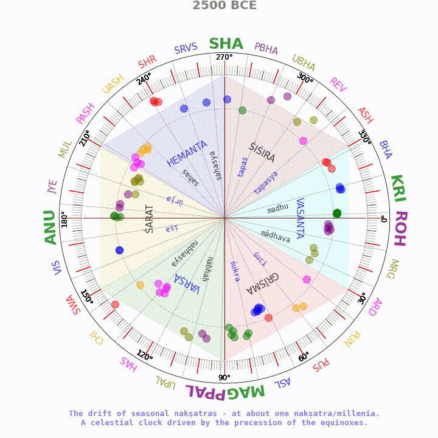

# cahc-utils — research projects and datasets

This repository collects small research projects, datasets and exploratory notebooks used by CAHC.

Top-level folders of interest

- `datasets/` — canonical place for input/output CSVs and processed data
- `linguistics/` — Sanskrit linguistics projects (verb animation, sound-pattern analysis)
- `jyotisha/` — astronomy / Vedanga Jyotisha experiments and notebooks
- `presentations/` — Marp / notebook based presentations and slides
- `scrape/` — scraping and data extraction utilities
- `stel_scripts/` — Stellarium scripts and examples
- `music/` — small music synthesis utilities

How to use

<video  controls autoplay loop>
	<source src="https://raw.githubusercontent.com/suchakr/cahc-utils/dataset-reorganization-2025-08/jyotisha/images/ayana-chalana.mp4" type="video/mp4">
	Your browser does not support the video tag.
</video>

1. Browse the folder for a project you care about. Most projects contain a README or a notebook.
2. For Python projects, create a virtualenv and install the project's `requirements.txt` where present.
3. Treat this repo as working research artefacts — expect rough edges and local scripts.

Contributing

If you add a dataset or useful script, please include a short README in the folder explaining inputs, outputs and usage.

Questions or missing docs? Open an issue or send a PR with improved documentation.

