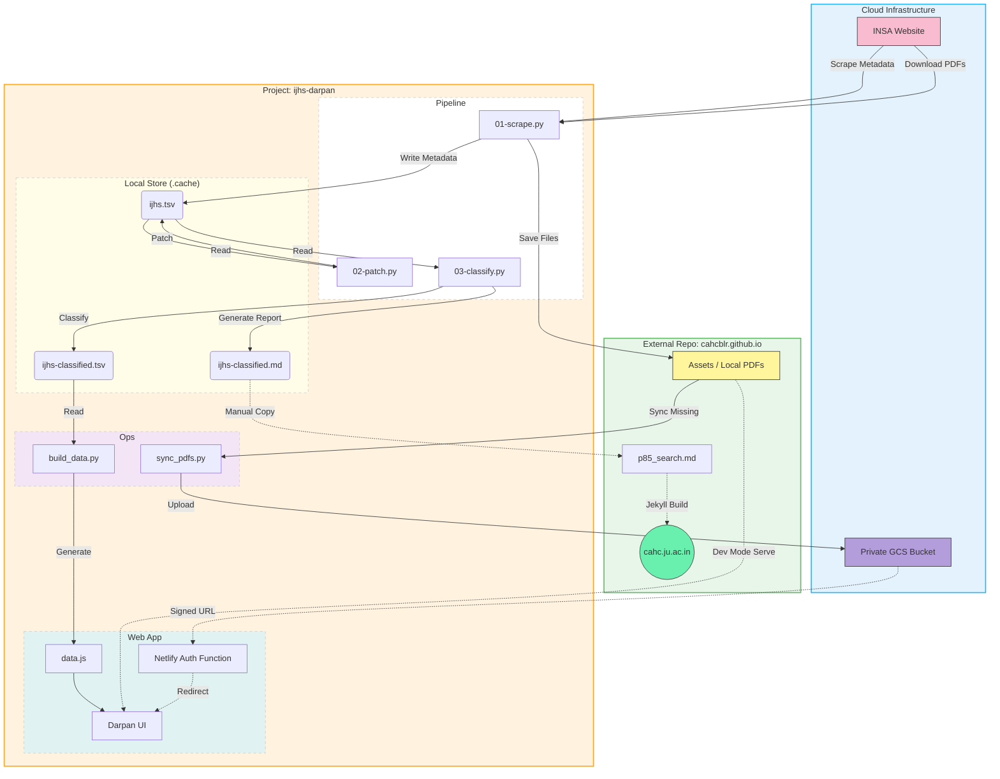
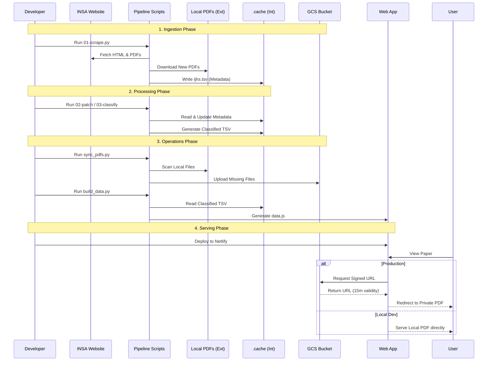

# IJHS Darpan

The Indian Journal of History of Science (IJHS) "Darpan" (Mirror) is a project to index, classify, and serve the archives of the IJHS.

## Project Structure

This project has been refactored (Jan 2026) into the following components:

- **`pipeline/`**: Data ingestion and processing scripts.
  - `01-scrape.py`: Scrapes metadata from INSA portal.
  - `02-patch.py`: Fixes metadata errors.
  - `03-classify.py`: Uses Gemini LLM to classify new papers.
  - `04-compare.py`: Compares classification with legacy p85 search.
- **`web/`**: The web application (Netlify).
  - Contains `index.html`, `assets/`, and `netlify/` functions.
- **`ops/`**: Operational utilities.
  - `build_data.py`: Generates `data.js` for the web app.
  - `sync_pdfs.py`: Syncs local PDFs to private GCS bucket.
- **`.cache/`**: Local data store.
  - Contains `ijhs.tsv` (Source of Truth), `ijhs-classified.tsv`, and intermediate artifacts.

## Data Flow Architecture



## Data Lifecycle (Sequence)

This sequence diagram illustrates the step-by-step flow from data ingestion to user serving.




## Usage

### 1. Data Pipeline
The pipeline scripts should be run in sequence to ensure data integrity:

```bash
uv run pipeline/01-scrape.py   # Scrape new metadata
uv run pipeline/02-patch.py    # Fix known metadata errors
uv run pipeline/03-classify.py # Classify new papers
```

### 2. Operations
To regenerate the web application data:

```bash
uv run ops/build_data.py
```

To sync PDFs to GCS (requires credentials):

```bash
uv run ops/sync_pdfs.py
```

### 3. Web Development
Navigate to `web/` and use Netlify CLI:

```bash
cd web
netlify dev
```
