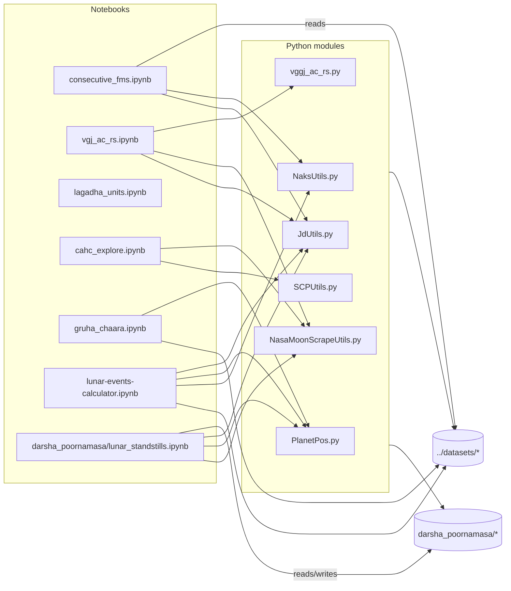

# jyotisha

A small collection of exploratory Jupyter notebooks and helper modules related to historical lunar/astronomical calculations and calendrical analysis.

This directory is a research/dev workspace rather than a production package. The notebooks evolved over time; this README gives a gentle introduction, points to supporting Python modules, and outlines a simple dev environment and data layout so new contributors can get started quickly.

## Quick map (files)
- Notebooks
  - `consecutive_fms.ipynb` — full-moon sequence / "smud" analysis (BCE full-moon dataset)
  - `vgj_ac_rs.ipynb` — exploratory analysis, companion to `vgj_ac_rs.py`
  - `lagadha_units.ipynb` — small computations and notes about Lagadha units
  - `cahc_explore.ipynb` — general exploratory notebook for ad-hoc checks and plots
  - `gruha_chaara.ipynb` — domain-specific analysis (motion/house related)
  - `lunar-events-calculator.ipynb` — event calculation examples (uses JD/planet helpers)
  - `darsha_poornamasa/lunar_standstills.ipynb` (occasionally present as `lunar_standstills.ipynb.backup`) — analyses and slides around lunar standstills; contains example CSVs and rise/set tables under `darsha_poornamasa/`
- Notebook summaries
  - `notebooks-summaries.md` — extracted first markdown cell from each notebook (a quick reference of notebook descriptions and starting notes)
- Python helper modules
  - `NasaMoonScrapeUtils.py` — scraping utilities for NASA moon tables / retrievals
  - `NaksUtils.py` — nakshatra / lunar mansion helpers
  - `JdUtils.py` — Julian date helpers and conversions
  - `vgj_ac_rs.py` — functions used by the `vgj_ac_rs` notebook
  - `SCPUtils.py` — small support utilities (search/convert/plot helpers)
  - `PlanetPos.py` — planet position helper functions
  - `__init__.py`
- Data (expected)
  - Notebooks typically read data from a sibling `datasets` folder: `../datasets/...`
  - Examples:
    - `../datasets/full_moons/astropy-fm-bce-2500.tsv` (used by `consecutive_fms.ipynb`)
    - `cahc-utils/jyotisha/darsha_poornamasa/*.csv` (rise/set, eclipse lists, standstill outputs)

## Short description of key notebooks
- `consecutive_fms.ipynb` — computes JD differences between consecutive full moons, the "smud" pattern, groups by century, and searches for repeated last-digit patterns in 6-month step sequences.
- `vgj_ac_rs.ipynb` — exploratory notebook tied to `vgj_ac_rs.py`; contains experiments and examples for calculations captured in the module.
- `lagadha_units.ipynb` — notes and computations relevant to traditional measures and unit systems (Lagadha).
- `cahc_explore.ipynb` — catch-all exploration space; useful when investigating ad-hoc problems or data samples.
- `gruha_chaara.ipynb` — focused analysis (domain-specific; check markdown cells for assumptions).
- `lunar-events-calculator.ipynb` — uses `JdUtils`, `PlanetPos`, `NaksUtils` to demonstrate event calculations (eclipses, rise/set examples).
- `darsha_poornamasa/lunar_standstills.ipynb` — analysis of lunar standstills; includes CSV outputs such as long-run rise/set tables and example eclipse/stillness datasets. Note: sometimes this appears as `lunar_standstills.ipynb.backup` and there are HTML slides (`lunar_standstill.slides.html`) — treat `darsha_poornamasa/` as both a data and results folder for standstill calculations.
- `soma_srnga/` — analysis of lunar cusps (shrnga), including calculations and visualizations for rising and setting moon.

## Relationship diagram (developer view)

Below is a simple Mermaid diagram showing relationships. Notebooks call into the Python modules and read datasets under `../datasets/` and also use CSVs in `darsha_poornamasa/`:



## Developer-friendly setup (recommended)

Goal: reproducible, minimal, easy to extend.

Suggested minimal packages (unpinned):
```
astropy
pandas
numpy
matplotlib
scipy
seaborn
IPython
ephem
Pillow  # PIL
astroplan
joblib
tqdm
sympy
swifter  # optional; used in some notebooks

# Developer tools
jupyterlab
notebook
ipywidgets
pip-tools
```

For reproducible pins, create a venv and use `pip-compile` (pip-tools) or install and run `pip freeze` to create a pinned `requirements.txt`.


## Dev files added

- `requirements.in` — unpinned top-level dependencies; run `pip-compile requirements.in` to produce a pinned `requirements.txt`.
- `notebooks-summaries.md` — extracted first markdown cell from each notebook (generated by `tools/extract_notebook_summaries.py`).
- `tools/smoke_test.py` — quick import smoke-test to validate the dev environment.
- `tools/extract_notebook_summaries.py` — script used to generate `notebooks-summaries.md`.

Should `tools/` be checked in?

- Short answer: yes, if the tools are useful to future contributors and are idempotent. These particular tools are small helpers (extracting summaries, a smoke-test) and are safe to keep in the repo. If a tool is purely a one-off or contains secrets, keep it out of version control.


## Running notebooks & quick tips

Run Jupyter Lab from the `cahc-utils/jyotisha` folder:

```bash
cd cahc-utils/jyotisha
python3 -m venv .venv
source .venv/bin/activate
pip install --upgrade pip
pip install -r requirements.txt
jupyter lab
```

## Data layout and tips

Keep raw datasets under the top-level `datasets` folder (sibling to `cahc-utils`):

- Example: `datasets/full_moons/astropy-fm-bce-2500.tsv`
- `darsha_poornamasa/` under `jyotisha` contains standstill-related CSVs and example outputs. Treat it as a local data/results folder for standstill experiments.
- Prefer relative paths (`../datasets/...`) in notebooks to maintain portability.

## Small code hygiene suggestions

Prefer importing functions from `.py` modules rather than copying code into notebooks.

Add `if __name__ == "__main__":` guards in scripts intended to be runnable.

Consider adding `tools/smoke_test.py` to check imports quickly.

## Next steps

I can help pin the requirements, add a smoke-test, or extract notebook metadata (first markdown cells) to expand notebook descriptions.
