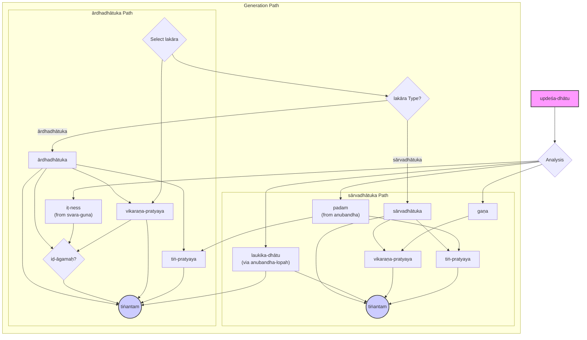

# Sanskrit Verb Generation Animator

This project is an interactive web application that demonstrates the step-by-step generation of Sanskrit verbs (तिङ्न्त forms) using Paninian grammar principles.

**Live Application:** [dhaatu-animation.html](dhaatu-animation.html)

---

## Development History

<details>
<summary><strong>Original Prompt</strong></summary>

# Sanskrit Verb Animation - Original Request

I am thinking of an animation to illustrate the generation of verbs using these principles. Assuming there is a dhaatu-paatha with and list of sutras listed in the md, can we imagine an animated sequence that fill the template of placeholders that compromise the components of tinantam yield the tinantam finally.

The animation-app-incomplete.html is an incomplete realization. Can you generate animation-app.html which is complete.

## Note

This was the original prompt that led to a 20-iteration development process. For a more comprehensive prompt that could generate similar results in fewer iterations, see **dhaatu-prompt.md** which provides detailed specifications, technical requirements, and implementation guidelines.

The final application was renamed to **dhaatu-animation.html** and includes:
- Complete Sanskrit verb derivation animation
- 6-step grammatical process visualization  
- 8 lakara support with proper classification
- Mobile-optimized smooth animations
- Floating result card with celebration
- Comprehensive sutra references
- Error handling and user feedback 

</details>

<details>
<summary><strong>Comprehensive Prompt for Faster Development</strong></summary>

# Sanskrit Verb Generation Animation App - Comprehensive Prompt

## Project Overview

Create an interactive web application that demonstrates the step-by-step generation of Sanskrit verbs (तिङ्न्त forms) using Paninian grammar principles. The app should be educational, visually appealing, and technically sound.

## Core Requirements

### 1. Application Structure

- **Single HTML file** with embedded CSS and JavaScript
- **Responsive design** that works on desktop and mobile devices
- **Modern web technologies** (CSS Grid, Flexbox, ES6+ JavaScript)
- **No external dependencies** - all code should be self-contained

### 2. Data Structure

Implement comprehensive dhatu derivation data including:

```javascript
const dhatu_derivation = {
    'dhatu_name': {
        // Basic dhatu information
        upadesa: 'उपदेश form',
        gana: 'गण name with number',
        artha: 'meaning',
        svaraguna: ['accent information'],
        
        // Grammatical derivation steps
        anubandha_sutras: ['sutra numbers for anubandha rules'],
        anubandha: 'anubandha letters or "none"',
        laukika: 'final dhatu after anubandha removal',
        
        itness_sutras: ['relevant it-rules'],
        itness: 'सेट्/अनिट्',
        
        pratyaya_classification_sutras: ['3.4.113', '3.4.114'],
        
        padam_sutras: ['pada determination sutras'],
        padam: 'परस्मैपदम्/आत्मनेपदम्/उभयपदम्',
        
        vikarana_sutras: ['vikarana sutras'],
        vikarana: { 'लट्': 'vikarana', 'लुट्': 'vikarana', ... },
        
        tin_endings: 'parasmaipada/atmanepada/ubhayapada',
        
        examples: { 'लट्': 'final form', 'लुट्': 'final form', ... }
    }
}
```

Include at least 10 dhatus covering different ganas including:

- भू (भ्वादि)
- अदँ (अदादि)
- हुँ (जुहोत्यादि)
- दिवु (दिवादि)
- षुञ् (स्वादि)
- तुद् (तुदादि)
- रुधिर् (रुधादि)
- तनुँ (तनादि)
- क्र���ञ् (क्र्यादि)
- चुर् (चुरादि)
- डुपचँष् (भ्वादि-उभयपद)

### 3. Sutra Collection

Implement categorized sutra references:

```javascript
const sutra_collection = {
    'it_rules': {
        '1.3.2': 'उपदेशेऽजनुनासिक इत्',
        '1.3.3': 'हलन्त्यम्',
        // ... more sutras
    },
    'padam_rules': { /* pada determination sutras */ },
    'vikarana_rules': { /* vikarana sutras */ },
    'itagama_rules': { /* iḍ-āgama sutras */ },
    'pratyaya_classification': { /* सार्वधातुक/आर्धधातुक sutras */ }
}
```

### 4. Lakara Support

- Support **8 lakaras**: लट्, लुट्, लङ्, लृट्, लोट्, विधिलिङ्, लुङ्, लृङ्
- Classify as **सार्वधातुक**: लट्, लोट्, लङ्, विधिलिङ्
- Classify as **आर्धधातुक**: लुट्, लृट्, लुङ्, लृङ्
- Include visual indicators (🔵 for सार्वधातुक, 🟣 for आर्धधातुक) in dropdown

### 5. Animation System

Create **6 main animation steps**:

1. **धातु-पाठ-अन्वेषणम्** - Display dhatu information
2. **अनुबन्ध-विश्लेषणम्** - Anubandha analysis and removal
3. **इडागम-निर्णयः** - iḍ-āgama determination based on pratyaya classification
4. **पद-निर्णयः** - Pada (voice) determination
5. **विकरण-निर्णयः** - Vikarana selection
6. **तिङ्-प्रत्यय-योजनम्** - Ting ending application

Each step should:

- **Highlight the active card** with visual emphasis (scaling, glow, color change)
- **Move active card to top** on mobile with smooth FLIP animation technique
- **Fill in information progressively** with appropriate delays
- **Light up relevant sutras** in a comprehensive sutra reference section
- **Show progress bar** indicating completion percentage

### 6. User Interface Design

#### Controls Section

```html
<div class="dhatu-selector">
    <select id="dhatu-select">/* dhatu options with gana info */</select>
    <select id="lakara-select">/* lakara with visual classification */</select>
    <select id="purusa-select">/* 9 purusa-vachana combinations */</select>
    <button onclick="startAnimation()">प्रक्रिया आरम्भः</button>
    <select id="speedPreset">
        <option value="none">None</option>
        <option value="slow">Slow</option>
        <option value="medium" selected>Medium</option>
        <option value="fast">Fast</option>
    </select>
</div>
```

#### Step Cards Layout

- Use **CSS Grid** with `repeat(auto-fit, minmax(250px, 1fr))`
- Cards should be **visually distinct** when inactive (opacity 0.3, translated down)
- **Active cards** should scale (1.05), glow, and have enhanced colors
- Include **property fields** that fill progressively during animation

#### Formula Display

```text
धातुः + इत्? + विकरणः + तिङ् = तिङ्न्तम्
```

- Show **dual formulas** for उभयपदम् dhatus (परस्मैपद/आत्मनेपद)
- Use **color coding** for different grammatical elements
- **Progressive filling** during animation

### 7. Advanced Features

#### Mobile Optimization

- **Card reordering animation** using FLIP technique
- **Smooth transitions** with `cubic-bezier(0.25, 0.1, 0.25, 1.0)` easing
- **Touch-friendly** controls and interactions

#### Animation Controls

- **Speed presets** affecting all timing (none/slow/medium/fast)
- **Disable animations** option for immediate results
- **Consistent timing** with speed multiplier system

#### Floating Result Card

- **Celebratory overlay** appearing at animation end
- **Gentle floating animation** with backdrop blur
- **Dual display** for ubhayapada results
- **Elegant close interaction**

#### Error Handling

- **Graceful degradation** for unsupported lakara-dhatu combinations
- **Clear error messages** in Devanagari
- **Recovery options** for users

### 8. Technical Implementation Guidelines

#### CSS Architecture

```css
/* Use modern CSS features */
.step-card {
    transition: all 0.8s ease;
    transform: translateY(20px);
    opacity: 0.3;
}

.step-card.active {
    transform: translateY(0) scale(1.05);
    opacity: 1;
    animation: gentleGlow 2s ease-in-out;
}

/* Responsive design */
@media (max-width: 768px) {
    .process-flow { grid-template-columns: 1fr; }
}
```

#### JavaScript Structure

```javascript
// Animation timing system
function sleep(ms) {
    const speedMultiplier = getAnimationSpeed();
    return new Promise(resolve => setTimeout(resolve, ms / speedMultiplier));
}

// FLIP animation for card reordering
function moveActiveCardToFirst(activeStepId) {
    // Record positions, move DOM, animate difference
}

// Main animation flow
async function startAnimation() {
    resetUI();
    await animateStep1(dhatu, data);
    await animateStep2(data);
    // ... continue for all steps
    showFloatingResult(data, lakara, purusa);
}
```

#### Grammatical Logic

- **Proper iḍ-āgama determination**: आर्धधातुक + सेट् → इट्
- **Accurate pada rules**: Follow 1.3.12, 1.3.72, 1.3.78
- **Correct vikarana mapping**: Per gana classification
- **Complete ting endings**: All 9 persons × 3 numbers for both padas

### 9. Content Requirements

#### Devanagari Text

- Use **Noto Sans Devanagari** font for Sanskrit content
- **Proper Unicode** encoding for all Devanagari text
- **Consistent transliteration** where needed

#### Educational Value

- **Progressive disclosure** of grammatical information
- **Sutra references** with explanations
- **Visual connections** between steps and rules
- **Error explanation** for learning opportunities

#### Cultural Sensitivity

- **Respectful treatment** of Sanskrit grammatical tradition
- **Accurate terminology** and rule applications
- **Traditional presentation** combined with modern UX

### 10. Performance & Compatibility

#### Optimization

- **Single file delivery** for easy deployment
- **Efficient animations** using CSS transforms
- **Minimal DOM manipulation** during animations
- **Memory-conscious** event handling

#### Browser Support

- **Modern browsers** (Chrome, Firefox, Safari, Edge)
- **Graceful fallbacks** for older browsers
- **Mobile browser optimization**

## Expected Outcome

The final application should be:

1. **Educationally comprehensive** - teaching Sanskrit verb derivation step-by-step
2. **Visually engaging** - with smooth animations and professional design
3. **Technically robust** - working across devices and browsers
4. **Culturally authentic** - respecting Sanskrit grammatical tradition
5. **User-friendly** - intuitive interface with helpful feedback

This should result in a polished, production-ready web application that serves as both an educational tool and a demonstration of modern web development techniques applied to classical Sanskrit grammar.

## Implementation Notes

- Start with the data structures and core logic before adding animations
- Test thoroughly with different dhatu-lakara combinations
- Ensure all sutras are accurately referenced and applied
- Validate Sanskrit content with grammatical authorities
- Optimize for both learning and aesthetic experience

The final product should demonstrate that traditional Sanskrit grammar can be made accessible and engaging through thoughtful application of modern technology.

</details>

---

## Grammar Reference (Dhaatu-paatha Notes)

# पाणिनीयधातुपाठस्य ���म्प्रयोगबोधनम्

## मङ्गलश्लोकाः

- येनाक्षरसमाम्नायमधिगम्य महेश्वरात्  
  कृत्स्नां व्याकरणं प्रोक्तं तस्मै पाणिनये नमः ॥
- येन धौता गिरः पुंसां विमलैः शब्दवारिभिः  
  तमश्चाज्ञानजं भिन्नं तस्मै पाणिनये नमः ॥
- वाक्यकारं वररुचिं भाष्यकारं पतञ्जलिम्  
  पाणिनिं सूत्रकारं च प्रणतोऽस्मि मुनित्रयम् ॥

## उपोद्धातः

### पाणिनीयपञ्चकम्

1. अष्टाध्यायी (सूत्रपाठः / अष्टकम्) — ~4000 सूत्राणि  
2. धातुपाठः — ~2000 धातवः  
3. गणपाठः — शब्दानां गणाः  
4. लिङ्गानुशासनम् — लिङ्गविषयकाः नियमाः  
5. पाणिनीयशिक्षा — वर्णोच्चारणविधयः

---

## धातुपाठस्य स्वरूपम्

- ~2000 धातवः, 10 मुख्यगणाः
- धातुनाम्:
  - अर्थः
  - पदम् (पदम्/आत्मनेपदम्)
  - इडागमः (सेट्/अनिट्/वेट्)
  - अन्तर्गणाः इत्यादयः

**उदाहरणः:**  
`भू` — सत्तायाम् (भ्वादिगणः, परस्मैपदी, सेट्)  
**रूपाणि:** भवति, भवतः, भवन्ति...

---

## गणाः तथा विकरणप्रत्ययाः

| गणः        | प्रथमधातुः | विकरणप्रत्ययः | धातुसंख्या |
|------------|-------------|----------------|--------------|
| भ्वादिः     | भू           | शप् (अ)         | 1010         |
| अदादिः     | अद्          | — (शपः लुकू)   | 72           |
| जुहोत्यादिः | हु           | — (शपः श्लुः)   | 24           |
| ...        | ...         | ...            | ...          |

## धातुपाठे गणाः, विकरणप्रत्ययाः, तथा गणविधायक-सूत्राणि

| गणः   | विकरण-प्���त्ययः   | गणविधायक-सूत्रम्          | धातुसंख्या |
|-------|-------------|----------------------|------------|
| भ्वादिः   | शप् (अ)     | कर्तरि शप् (३.१.६८)        | 1010 |
| अदादिः  | — (शपः लुक्)  | अदिप्रभृतिभ्यः शपः (२.४.७२)   | 24 |
| जुहोत्यादिः | — (शपः श्लुः)  | जुहात्यादिभ्यः श्लुः (२.४.७५)  | 34 |
| दिवादिः  | श्यन् (य)    | दिवादिभ्यः श्यन् (३.१.६९)   | 25 |
| स्वादिः  | श्नुः (नु)    | स्वादिभ्यः श्रुः (३.१.७३)  | 61 |
| तुदादिः   | शः (अ)      | तुदादिभ्यः शः (३.१.७७)     | 72   |
| रुधादिः  | श्नम् (न)      | रुधादिभ्यः श्रम् (३.१.७८)     | 140 |
| तनादिः   | उः           | तनादिकृञ्भ्य उः (३.१.७९)    | 157 ्
| क्र्यादिः  | श्ना (ना)    | क्र्यादिभ्यः श्रा (३.१.८१)   | 10 |
| चुरादिः  | णिच् (इ)    | ...चूर्णचुरादिभ्यः णिच् (३.१.२५) | 410 |

## 

| गणः | विकरणः | सार्वार्ध | धातुः | स्वरवर्णः | इत्सञ्ज्ञा | प्राकृतधातुः| पदम् | सेट्/अनिट् | लट् प्र ए | स्वर-स्थिति |
|----|------|------|----|-----------|-----|-------|----|--------|-----------|-------|
| भ्वादिः | शप् →अ | सा  | भू  | ऊ-उद       | —    | भू  | प   | सेट्     | भवति     | उदात्तः शेषः |
| अदादिः | शप् लुक् | सा | अदँ | अ–अ, अँ–स्↓ | अँ     | अद् | प  | अनिट्   | अत्ति     | अनुदात्तः शेषः, स्वरितः इत् |
| जुहोत्यादिः| शप् →श्लु | सा | हु  | उ–उद       | —    | हु  | प   | सेट्    | जुहोति    | उदात्तः शेषः |
| दिवादिः | श्यन् →य | सा | दिवु | इ-��द↓      | उ     | दिव् | प   | सेट्    | दीव्यति   | उदात्तः इत् (धातु = अनुदात्त) |
| स्वादिः | श्नुः →नु   | सा | षुञ् | उ–उद        | ञ्     | सु  | प  | सेट्    | सुनोति    | उदात्तः शेषः |
| तुदादिः | श →अ  | सा | तुद्  | उ–अ        | —     | तुद् | प  | अनिट्   | तुदति     | अनुदात्तः शेषः |
| रुधादिः| श्नम् →न  | सा | रुधिर् | उ–अ↓, इ–अ↓ | र्     | रुध् | प  | अनिट्   | रुणद्धि    | अनुदात्तौ इत्, नवा स्वरः न शेषः |
| तनादिः| उः      | सा | तनुँ  | अँ–स्↓       | ङ्     | तनु | उ  | सेट्    | तनोति     | स्वरितः इत्, अनुदात्तः शेषः |
| क्र्यादिः | श्ना →ना | सा  | क्रीञ् | ई–उद       | ञ्     | क्री | उ  | सेट्    | क्रीणाति    | उदात्तः शेषः |
| चुरादिः | णिच् →इ | आ | चुर्  | उ–अ        | —     | चुर् | प  | अनिट्   | चोरयति    | अनुदात्तः शेषः |
| भ्वादिः | शप् →अ  | सा | डुपचँष् | अ–अ अँ–स्↓ | डु अँ ष् | पच् | उ  | अनिट्    | पचति / पचते | अनुदात्तः शेषः, स्वरितः इत् |

---

## पदसंज्ञाः 

- **तिङन्तम्** = धातुः + विकरणप्रत्ययः + तिङ्प्रत्ययः  
- **सार्वधातुकप्रत्ययाः** – शप्, श्यन्, श्ना, इत्यादयः  
- **आर्धधातुकप्रत्ययाः** – लुट्-तास्, स्य, सिच्...

---

## इत्संज्ञाः (अनुबन्धाः)

- अनुनासिकस्वरः = इत्
- हलन्त्यम् = इत्
- आदिर्जिटुडवः = इत्

---

## पदनिर्णयः – आत्मनेपदम्/परस्मैपदम्/उभयपदम्

- **अनुदात्त-डितः** = आत्मनेपदम्  
- **उदात्तेतः** = परस्मैपदम्  
- **स्वरितेतः/जित्** = उभयपदम्

---

## इडागमः

- सूत्रम्: *आर्धधातुकस्येड् वलादेः* (७.२.३५)  
- उदात्तः = सेट् → इडागमः भवति  
- अनुदात्तः = अनिट् → इडागमः न भवति

**उदाहरणम्:**  
`भू + इ + स्य + ति = भविष्यति`  
`पच् + ता = पत्ता`

---

## अध्ययनक्रमः

1. गण-निश्चितिः
2. स्वर-निश्चितिः (उदात्तः/अनुदात्तः)
3. पद-निश्चितिः (प.प./आ.प./उभ.)
4. विकरणप्रत्ययस्य ज्ञापनम्
5. रूपसिद्धिः

---

## शुद्धरूपाणां अभ्यासः

- धातुपाठात् धातुः चुन्य, लकारानुसारं रूपनिर्माणम्  
- उदाहरणेन → धातुः ‘अद्’ → ‘अत्ति’, ‘अदति’, ‘अदात्’ इत्यादि

# सूची: सन्धर्भगताः सूत्राणि (Sūtras from the Presentation)

| Sūtra Number | Sūtra Text               | Application                                 | FunctionGroup                  |
|--------------|--------------------------|---------------------------------------------|-------------------------------|
| 1.3.2        | उपदेशेऽजनुनासिक इत्            | it-sañjñā for nasalized vowels              | It-Saṃjñā Rules               |
| 1.3.3        | हलन्त्यम्                    | it-sañjñā for final consonants               | It-Saṃjñā Rules               |
| 1.3.5        | आदिर्ञिटुडवः                 | it-sañjñā for initial ñi & ṭu, ḍu            | It-Saṃjñā Rules               |
| 1.3.9        | तस्य लोपः                  | Elision of it-sañjñā                         | It-Saṃjñā Rules               |
| 1.3.12       | अनुदात्तङित आत्मनेपदम्           | ātmane-pada on anudāta + it                 | Pada Assignment               |
| 1.3.72       | स्वरितज्ञितः कर्त्रभिप्राये क्रियाफले     | ubhaya-pada on svarita or jñ+ it            | Pada Assignment               |
| 1.3.78       | शेषात कर्तरि परस्मैपदम्           | parasmaipada otherwise                      | Pada Assignment               |
| 2.4.72       | अदिप्रभृतिभ्यः शपः               | Assigns śap (lopa) to adādi-gaṇa            | Vikaraṇa Assignment           |
| 2.4.75       | जुहात्यादिभ्यः श्लुः               | Assigns ślu to juhotyādi-gaṇa               | Vikaraṇa Assignment           |
| 3.1.25       | ...चूर्णचुरादिभ्यः णिच्           | Assigns ṇic to curādi-gaṇa                  | Vikaraṇa Assignment           |
| 3.1.68       | कर्तरि शप्                   | Assigns śap to bhvādi-gaṇa                  | Vikaraṇa Assignment           |
| 3.1.69       | दिवादिभ्यः श्यन्                | Assigns śyan to divādi-gaṇa                 | Vikaraṇa Assignment           |
| 3.1.73       | स्वादिभ्यः श्नुः                  | Assigns śnu to svādi-gaṇa                   | Vikaraṇa Assignment           |
| 3.1.77       | तुदादिभ्यः शः                  | Assigns śa to tudādi-gaṇa                   | Vikaraṇa Assignment           |
| 3.1.78       | रुधादिभ्यः श्नम्                 | Assigns śnam to rudhādi-gaṇa                | Vikaraṇa Assignment           |
| 3.1.79       | तनादिकृञ्भ्य उः                | Assigns uḥ to tanādi-gaṇa                   | Vikaraṇa Assignment           |
| 3.1.81       | क्र्यादिभ्यः श्ना                 | Assigns śnā to kryādi-gaṇa                  | Vikaraṇa Assignment           |
| 3.4.113      | तिङ्शित्सार्वधातुकम्              | sārvadhātuka-pratyaya on tiṅśit              | Pratyaya Classification       |
| 3.4.114      | आर्धधातुकं शेषः                 | ārddhadhātuka-pratyaya on not tiṅśit        | Pratyaya Classification       |
| 7.2.10       | एकाच उपदेशेऽनुदात्तात्             | iḍ-āgama blocked on single anudāta acaḥ      | Iḍ-āgama Rules                |
| 7.2.35       | आर्धधातुकस्येड् वलादेः             | iḍ-āgama before ārdhadhātuka's val         | Iḍ-āgama Rules                |
| 7.2.44       | स्वरतिसूतिसूयतिधूञूदितो वा          | id-āgama - with or without on ūdit         | Iḍ-āgama Rules                |

## Verb Derivation Procedure

### Some definitions

- updeśa-dhātu - These terms are listed in dhātu-pātha .  These contains laukika-dhātu surrounded optionally by anubandha
- anubandha - These markers, also called it-sañjñā, are placed in updeśa-dhātu to trigger grammar rules. These are elided before tiṅantam generation. 
- svara-guna - These describe the accent properties of svaras of the updeśa-dhātu. presence(udāttaḥ, anudāttaḥ, svaritaḥ, ūdit), elision(udāttetaḥ, anudāttetaḥ, svaritetaḥ,)  are its types
- gaṇa - Groups of updeśa-dhātu . There are 10 gañas. Each gaṇa has its vikaraṇa-pratyaya.
- laukika-dhātu - The term obtained after anubandhas are elided from updeśa-dhātu. This is vocalizable part of the updeśadhātu.
- tiṅantam - Is the actualized verb from laukika-dhātu + iḍ-āgamaḥ? + vikarṇa-pratyaya + ākhyata-pratyaya. These can be thought as kriya-padams. 
- lakara - Is a collection of tiṅantam capturing a certain tense or mood. There are 10 lakaras laṭ laṅ loṭ vidhiliṅ luṭ lṛṭ luṅ lṛṅ leṭ & āśīrliṇ
- sārvadhātuka-lakara - laṭ laṅ loṭ vidhiliṅ lakaras are called so. The tiṅantams in these use sārvadhātuka-pratyaya
- sārvadhātuka-pratyaya- the pratyayas that belong to tiṇ-pratyaya and śip-pratyaya
- tiṇ-pratyaya - Two groups of nine 9 pratyayas each. One group of parasmaipadam and the other for ātmanaipadam. Also known as  ākhyata-pratyaya
- śip-pratyaya - The pratyayas of these types from gaṇas(śp śyan śnā śnu śnam) others(śatṛ śānac khaś  etc).
- ārdhadhātuka-lakara -  luṭ lṛṭ luṅ lṛṅ lakaras are called so. The tiṅantams in these use updeśadhātu's lakaras vikaraṇa-pratyaya  
- ārdhadhātuka-pratyaya - non tiṇ+śip verb pratyayas
- anubandha-lopah - The process of removing anubandha from updeśa-dhātu  . it-sañjñā-lopah or it-lopah is an alternate name. 
- vikarṇa-pratyaya - These contribute to generation of tiṅantams. śip-pratyaya for sārvadhātuka-lakara  , non  tiṇ+śip verb pratyayas for ārdhadhātuka-lakara
- pratyaya - affixes attached to noun or verb roots. In this discussion pratyaya are in verb context
- seṭ - A property of a updeśa-dhātu indicating possibility of iḍ-agama. This property is set on udāttaḥ svara-guna 
- aniṭ - A property of a updeśa-dhātu indicating prohibition of iḍ-agama. This property is set on anudāttaḥ svara-guna  
- veṭ - A property of a updeśa-dhātu that allows both form with and without iḍ-agama. This property is set on ūdit svara-guna 
- parasmaipadam - A property of updeśa-dhātu indicating udāttetaḥ or absence of any elision in it svara-guna. These updeśa-dhātu take parasmaipadam block of tiṇ-pratyaya for tiṅantam 
- ātmanaipadam - A property of updeśa-dhātu indicating anudāttetaḥ .These updeśa-dhātu take ātmanaipadam block of tiṇ-pratyaya for tiṅantam
- ubhayapadam - A property of updeśa-dhātu indicating svaritetaḥ. These updeśa-dhātu take both ātmanaipadam and parasmaipadam forms.
- dhātu-pātha - A list of 2000 updeśa-dhātus spread over 10 gaṇas. For each updeśa-dhātu its gaṇa and svara-guna properies are listed.
- iḍ-agmaḥ - set if vikarṇa-pratyaya starts with val (all consonants barring y) in ārdhadhātuka-lakara . 


### tiṅantam generation process
- Given a updeśa-dhātu
- We get
  - gaṇa - by dhātu-pātha lookup
  - svara-gunas - by dhātu-pātha lookup
  - laukika-dhātu -  by applying anubandha-lopah 

- For each lakra in (sārvadhātuka-lakara)
  - We get the following properties of updeśa-dhātu's 
    - vikarṇa-pratyaya - from the gaṇa ( one of 10 of these śp śyan śnā śnu śnam ..)
    - iṭ-ness -  from the svara-gunas (one of 3 of these seṭ , aniṭ or veṭ)
    - padam - from the anubandha ( one of 3 of these ātmanaipadam, ubhayapadam or parasmaipadam)
    - iḍ-agmaḥ - not applicable
    - applicable-tiṇ-pratyaya = lookup tiṇ-pratyaya based on padam 
    - tiṅantam = laukika-dhātu + vikarṇa-pratyaya + applicable-tiṇ-pratyaya 

- For each lakra in (ārdhadhātuka-lakara )
  - We get the following properties of updeśa-dhātu's 
    - vikarṇa-pratyaya - from the lakara ( assume tas for now .. to be refined)
    - iṭ-ness -  from the svara-gunas (one of 3 of these seṭ , aniṭ or veṭ)
    - padam - from the anubandha ( one of 3 of these ātmanaipadam, ubhayapadam or parasmaipadam)
    - iḍ-agmaḥ - from the vikarṇa-pratyaya ( either set or not)
    - applicable-tiṇ-pratyaya = lookup tiṇ-pratyaya based on padam 
    - tiṅantam = laukika-dhātu + vikarṇa-pratyaya + applicable-tiṇ-pratyaya 


*Source:* Vyoma Sanskrita Pathashala – “Learn to Use Dhātupāṭha Effectively”  
Instructor: Vid. Vaishnava Simha  
Website: [sanskritfromhome.org](http://www.sanskritfromhome.org)


---

## Diagram: tiṅantam Generation Process



---
## Changelog

### Sutra Reference Integration Summary

- **Task Completed**: Successfully integrated the comprehensive sutra reference list from `sutra-list.html` into the main verb generation animation app (`dhaatu-animation.html`) as a tabbed interface for self-study without cluttering the animation experience.
- **Implementation Details**:
    - Added a clean tab navigation in the header (Animation Tab & Sutra Reference Tab).
    - Integrated all 21 sutras, organized into 5 functional groups.
    - Maintained consistent visual styling and mobile-responsive design.
- **Result**: The app now combines interactive animation with a comprehensive sutra reference, creating a complete educational resource.
