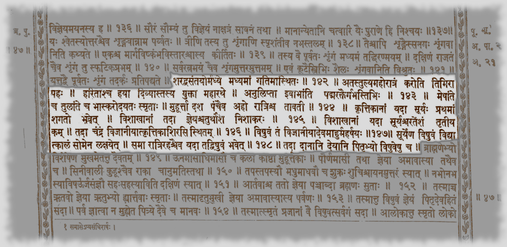

# Tools for ancient Indian astronomy and cosmography

## Two tutorial sessions

Working subtitle:

- `How modern tools help us see, test, and illustrate ancient astronomical ideas`

Working spoken opener:

- `In these sessions, I show how we use modern tools to inspect, test, and illustrate ancient astronomical ideas.`

## Paper-core asset shortlist

These are the assets to prefer first, because they are closest to the core paper argument and are more likely to align with Prof. Iyengar's visual preference.

### Sun-transit core assets

- `/Users/sunder/projects/cahc/cahc-utils/presentations/sun-transit/sun-transit-adityacara-charts.png`

- `/Users/sunder/projects/cahc/cahc-utils/presentations/sun-transit/sun-transit-rtusvabhava-charts.png`

- `/Users/sunder/projects/cahc/cahc-utils/presentations/sun-transit/sun-transit-transition-abhijit.png`

- `/Users/sunder/projects/cahc/cahc-utils/presentations/sun-transit/sun-transit-nakshatra-table.png`

- `/Users/sunder/projects/cahc/cahc-utils/presentations/sun-transit/sun-transit-astrographs.png`

### Equinoctial full-moon core assets

- `/Users/sunder/projects/cahc/cahc-utils/presentations/equinoctial-full-moon/bp-equinoctial-full-moon-better.png`

- `/Users/sunder/projects/cahc/cahc-utils/presentations/equinoctial-full-moon/mau-magha-scheme.png`

- `/Users/sunder/projects/cahc/cahc-utils/presentations/equinoctial-full-moon/bp-२१-१४२-१४९-devanaagari.jpeg`

### Additional asset pool for precession / equinoctial full moon

- `/Users/sunder/projects/cahc/cahc-utils/jyotisha/images/ms-book/pg29-eqfm_paper_submit.png`
- `/Users/sunder/projects/cahc/cahc-utils/presentations/2026-03-23-iks-astro-talk/pics/eq-fm-color.png`

### Optional enhancements only

Use only if they add clarity without pulling attention away from the paper-core figures:

- `/Users/sunder/projects/cahc/cahc-utils/presentations/sun-transit/sun-transit-ayana.gif`
- `/Users/sunder/projects/cahc/cahc-utils/presentations/sun-transit/sun-transit-ayana.mp4`
- `/Users/sunder/projects/cahc/cahc-utils/presentations/sun-transit/sun-transit-precession.gif`
- `/Users/sunder/projects/cahc/cahc-utils/presentations/sun-transit/sun-transit-precession.mp4`
- `/Users/sunder/projects/cahc/cahc-utils/presentations/equinoctial-full-moon/ndial_1.gif`
- `/Users/sunder/projects/cahc/cahc-utils/presentations/equinoctial-full-moon/ndial_1.mp4`
- most assets under `/Users/sunder/projects/cahc/cahc-utils/presentations/2024-03-17-mythic`

## Session 1

### title

- `Seeing the Ancient Sky with Stellarium`

### goal

- give the audience a usable visual grammar for the rest of the workshop
- show how Stellarium helps us inspect visible astronomical ideas before moving to research interpretation

### timing sketch

| Section | Time |
|---|---:|
| 1. Stellarium basics and sky culture | 15 min |
| 2. Dhruva, Thuban, Śiśumāra, precession | 20 min |
| 3. Sun: daily and annual motion | 15 min |
| 4. Nakṣatras: stars, shapes, zones | 20 min |
| 5. Precession and seasonal markers in sun-transit work | 15 min |
| 6. Short recap / questions | 5 min |

### 1. Stellarium basics and sky culture

Purpose:

- orient the audience to the software as a scholarly visual aid
- introduce the minimum controls and concepts needed for the rest of the tutorial

Likely content:

- location
- date / epoch
- time flow
- ecliptic / equator / Alt-Az / meridian
- projections
- clutter control
- brief note on sky culture

Primary assets:

- built-in Stellarium help screen during live demo
- local talk scripts under `/Users/sunder/projects/cahc/cahc-utils/presentations/2026-03-23-iks-astro-talk/ssc`

Notes:

- useful content from `demo.md` to fold into the actual session:
  - install location: desktop vs web
  - setting location
  - setting time
  - setting directions
  - find/search object
  - managing clutter: stars, planets, labels, atmosphere, coordinate lines
  - Sun, Moon, and nakṣatra as the three immediate tutorial objects
- instead of depending on `stel_keys.md`, show the built-in Stellarium help / shortcuts screen live
- this removes one peer dependency from public-facing artifacts

Primary script:

- none required; live manual orientation is better here

Backup / support:

- screenshots may be added later if live orientation feels too slow

Status:

- anchored

### 2. Dhruva, Thuban, Śiśumāra, and precession intuition

Purpose:

- show how precession changes the pole-star situation
- visually connect Dhruva, Abhaya Dhruva, Thuban, and Śiśumāra

Likely content:

- pole position near 2840 BCE at 30°N
- Thuban / Abhaya Dhruva
- visible pole star and loss of exact pole coincidence
- precession circles
- Matsya / Śiśumāra / Dhruva motif

Primary assets:

- paper support from Prof material later if needed

Primary scripts:

- `/Users/sunder/projects/cahc/cahc-utils/presentations/2026-03-23-iks-astro-talk/ssc/thuban-circumpolarity.ssc`
- `/Users/sunder/projects/cahc/cahc-utils/presentations/2026-03-23-iks-astro-talk/ssc/s1-02-main-dhruva-pole-drift.ssc`

Backup scripts:

- `/Users/sunder/projects/cahc/cahc-utils/presentations/2026-03-23-iks-astro-talk/ssc/matsya-sisumara-drift.ssc`

Notes:

- local copies are preferred for this project because the original `stel_scripts/*.{ssc,inc}` were written against Stellarium 0.22
- these local copies can now be smell-tested and tuned specifically for Stellarium 25.1
- scripts are worth keeping because they reliably set direction, FOV, ground, and related display state, which is easy to forget in live manual operation

Status:

- anchored, likely needs tuning

### 3. Sun: daily and annual motion

Purpose:

- show visible solar motion clearly
- distinguish horizon and meridian phenomena

Likely content:

- daily path
- sunrise shift on horizon
- annual motion
- high and low sun
- meridian altitude
- Dakṣiṇāyana and Uttarāyaṇa framing

Primary assets:

- no fixed static image required here
- this section should be carried mainly by Stellarium scripts and live state changes
- optional support only if needed:
  - `/Users/sunder/projects/cahc/cahc-utils/presentations/sun-transit/sun-transit-ayana.gif`
  - `/Users/sunder/projects/cahc/cahc-utils/presentations/sun-transit/sun-transit-ayana.mp4`

Primary scripts:

- `/Users/sunder/projects/cahc/cahc-utils/presentations/2026-03-23-iks-astro-talk/ssc/s1-03-main-sun-swing.ssc`
- `/Users/sunder/projects/cahc/cahc-utils/presentations/2026-03-23-iks-astro-talk/ssc/s1-03-sun-meridian-high-low.ssc`

Backup scripts:

- `/Users/sunder/projects/cahc/cahc-utils/presentations/2026-03-23-iks-astro-talk/ssc/a2_sun_analemma.ssc`

Notes:

- `s1-03-main-sun-swing.ssc` is more primary than `a2_sun_analemma.ssc`
- `s1-03-sun-meridian-high-low.ssc` is useful only if you want a brief, explicit meridian contrast after the horizon swing
- `a2_sun_analemma.ssc` is better treated as backup or secondary demonstration
- preferred Session 1 talk copies now exist under a sober prefix scheme
- keep the older local files as backup/reference until the new copies are smell-tested in Stellarium 25.1

Status:

- anchored

### 4. Nakṣatras: stars, shapes, zones, tour

Purpose:

- move from stars and asterisms to research-useful nakṣatra concepts

Likely content:

- 27 nakṣatras
- shapes
- Bayer notation
- asterisms and named stars
- nakṣatras as zones
- brief tour

Primary assets:

- `/Users/sunder/projects/cahc/cahc-utils/presentations/sun-transit/sun-transit-nakshatra-table.png`

- `/Users/sunder/projects/cahc/cahc-utils/presentations/sun-transit/sun-transit-astrographs.png`

Primary scripts:

- `/Users/sunder/projects/cahc/cahc-utils/presentations/2026-03-23-iks-astro-talk/ssc/s1-04-main-nakshatra-tour.ssc`

Backup scripts:

- no true backup script chosen yet

Technical support / contrast scripts:

- `/Users/sunder/projects/cahc/cahc-utils/presentations/2026-03-23-iks-astro-talk/ssc/naks-spot-check.ssc`
- `/Users/sunder/projects/cahc/cahc-utils/presentations/2026-03-23-iks-astro-talk/ssc/nakshatra-db.ssc`

Notes:

- `naks-spot-check.ssc` does not appear to add much visually to the nakṣatra-tour section
- it may still be useful as a contrast example:
  - Stellarium script structure
  - object/property extraction
  - runtime slowness compared with Astropy
- `nakshatra-db.ssc` is useful for showing what Stellarium gives out of the box for a single object over a small time window
- so both scripts fit better as technical-support examples than as audience-facing nakṣatra-tour demos

Status:

- anchored

### 5. Precession and seasonal markers in the sun-transit work

Purpose:

- connect the visual precession story to a research paper use case

Likely content:

- Maghādi solstice framing around 1800 BCE
- seasonal markers
- Vṛddha-Gārgīya material
- how precession is used with textual nakṣatra constraints for dating
- narration order should be chronological across the whole precession story:
  - BP chapter 21 first as the earliest anchor, around 1800 BCE
  - VGJ / Ādityacāra next, about 1350 BCE
  - VGJ / Ṛtusvabhāva next, about 500 BCE
  - BP chapter 21 then returns on day 2 for the full Moon-focused computational treatment
- brief dating note:
  - BP chapter 21: equinoctial full moon at fractional nakṣatra positions, about 1800 BCE
  - VGJ / Ādityacāra: 6 seasonal nakṣatras, about 1350 BCE
  - VGJ / Ṛtusvabhāva: 12 seasonal nakṣatras, about 500 BCE
- brief method note:
  - `jyotisha/vgj_ac_rs.py` and `.ipynb` for the VGJ materials
  - `jyotisha/cahc_explore.ipynb` for BP chapter 21
- analytical note:
  - BP chapter 21 can be introduced here with the same basic precession logic:
    - the text gives quarter-nakṣatra constraints for equinoctial full moons
    - candidate epochs are found by comparing computed full-moon longitudes against those targets
  - the BP case is better developed in session 2, because it brings in Moon-specific visualizations and the Astropy scan story
  - for each candidate epoch, compute the Sun's nakṣatra-alignment error against the textual seasonal targets
  - aggregate those errors across the target set and locate minima / transition zones
  - simple spoken example:
    - if the text says a given ṛtu should align with a given nakṣatra, measure how far the computed solar longitude at that epoch misses that target
    - repeat across many epochs
    - the epochs with the smallest total mismatch become the candidates
- paper-core figure first, then the best-fit support figure for all 27

Primary assets:

- `/Users/sunder/projects/cahcblr.github.io/assets/cached_papers/rni/1.pdf`
- `/Users/sunder/projects/cahcblr.github.io/assets/cached_papers/rni/01_58_4.pdf`
- `/Users/sunder/projects/cahc/cahc-utils/presentations/sun-transit/sun-transit-adityacara-charts.png`

- `/Users/sunder/projects/cahc/cahc-utils/presentations/sun-transit/sun-transit-rtusvabhava-charts.png`

- `/Users/sunder/projects/cahc/cahc-utils/presentations/sun-transit/sun-transit-transition-abhijit.png`

- `/Users/sunder/projects/cahc/cahc-utils/presentations/2026-03-23-iks-astro-talk/adityachara-naks-best-fit.png`

- `/Users/sunder/projects/cahc/cahc-utils/jyotisha/images/ms-book/pg21-ac-rs-epoch.png`

- `/Users/sunder/projects/cahc/cahc-utils/jyotisha/images/ms-book/pg29-eqfm_paper_submit.png`

Primary scripts:

- none; this section is better carried by the Dhruva script already shown plus the paper/core analytical figures

Backup scripts:

- none by default

Status:

- anchored

Note:

- `adityachara-naks-best-fit.png` is not a paper figure, but it is worth keeping because it clarifies the all-27 best-fit idea and is professor-approved
- `sun-transit-transition-abhijit.png` should be presented after the main seasonal-fit charts, as a transition / adjustment figure rather than as the entry figure
- the exact reason one chart visually reaches 0 while another does not should be verified from `vgj_ac_rs.py` before we state it confidently in the talk
- the dedicated precession bridge script was cut because it did not add enough beyond the Dhruva demo and the paper figures

## Session 2

### title

- `From Visual Demonstration to Research Workflow`

### goal

- show how visible demonstrations connect to analysis, search, visualization, and supporting digital tools

### timing sketch

| Section | Time |
|---|---:|
| 1. Continuation of the precession narrative: Moon, equinoctial full moon, and Astropy support | 30 min |
| 2. Eclipses: Parāśara Tantra and NASA/JLEX | 15 min |
| 3. Meru as cosmographic visualization | 15 min |
| 4. Digital tools and CAHC resources | 10 min |
| 5. AI-assisted chores and prototyping | 10 min |
| 6. Wrap-up / questions | 10 min |

### 1. Continuation of the precession narrative: Moon and the equinoctial full-moon problem

Purpose:

- continue the same precession-as-dating theme from day 1, now using the Moon and equinoctial full-moon problem

Likely content:

- BP 21.145-147
- 1/4 Kṛttikā and 3/4 Viśākhā
- visible equinoctial full moon positions
- a few Stellarium examples
- Astropy support should be folded into this theme rather than treated as a disconnected section
- brief comparison ladder:
  - manual / visual inspection
  - Stellarium scripted inspection
  - Astropy epoch scan and plotting

Primary assets:

- `/Users/sunder/projects/cahcblr.github.io/assets/cached_papers/rni/01_58_4.pdf`
- `/Users/sunder/projects/cahc/cahc-utils/presentations/equinoctial-full-moon/bp-equinoctial-full-moon-better.png`

- `/Users/sunder/projects/cahc/cahc-utils/presentations/equinoctial-full-moon/mau-magha-scheme.png`

- `/Users/sunder/projects/cahc/cahc-utils/presentations/equinoctial-full-moon/bp-२१-१४२-१४९-devanaagari.jpeg`

- `/Users/sunder/projects/cahc/cahc-utils/jyotisha/images/ms-book/pg29-eqfm_paper_submit.png`

- `/Users/sunder/projects/cahc/cahc-utils/presentations/2026-03-23-iks-astro-talk/pics/eq-fm-color.png`

Primary scripts:

- `/Users/sunder/projects/cahc/cahc-utils/presentations/2026-03-23-iks-astro-talk/ssc/s2-01-moon-swing.ssc`
- `/Users/sunder/projects/cahc/cahc-utils/presentations/2026-03-23-iks-astro-talk/ssc/s2-01-bp-eqfm-best-case.ssc`

Backup scripts:

- `/Users/sunder/projects/cahc/cahc-utils/presentations/2026-03-23-iks-astro-talk/ssc/full_moon_vgj.ssc`
- `/Users/sunder/projects/cahc/cahc-utils/presentations/2026-03-23-iks-astro-talk/ssc/a2_moon_analemma.ssc`

Optional enhancement:

- `/Users/sunder/projects/cahc/cahc-utils/presentations/equinoctial-full-moon/ndial_1.gif`
- `/Users/sunder/projects/cahc/cahc-utils/presentations/equinoctial-full-moon/ndial_1.mp4`

Status:

- anchored, likely needs demo choice refinement

### 2. Eclipses: Parāśara Tantra and NASA/JLEX

Purpose:

- connect an ancient statement on eclipse periodicity with modern searchable evidence

Likely content:

- PT pages 97-99
- sequence logic over lunations
- Jaipur visibility
- JLEX as a searchable verification tool

Primary assets:

- `/Users/sunder/projects/cahc/cahc-utils/presentations/2026-03-23-iks-astro-talk/pt-eclipse-table.jpg`

- `https://archive.org/details/YgQn_parashara-tantra-with-reconstructed-text-trans-and-notes-by-r-n-iyenger-jain-uni/page/97/mode/1up`
- `http://eclipse.gsfc.nasa.gov/JLEX/JLEX-AS.html`

Primary scripts:

- `/Users/sunder/projects/cahc/cahc-utils/presentations/2026-03-23-iks-astro-talk/ssc/a3-puri-demo.ssc`

Backup:

- static screenshot/table-led explanation if live demo feels too slow

Status:

- anchored

### 3. Meru as cosmographic visualization

Purpose:

- show how modern visualization can help communicate older cosmographic imagination

Likely content:

- Meru-Dhruva centered visualization
- multiple-source background, not one-text exclusivity
- interactive explanatory use
- one example of faster prototyping

Primary assets:

- `/Users/sunder/projects/meru/meru_cosmology.html`
- `/Users/sunder/projects/meru/meru_scenes.js`
- `/Users/sunder/projects/meru/meru_cosmology_PRD.md`

Primary script:

- none; Meru is its own demo

Backup:

- screenshots if browser/live interaction is risky

Status:

- anchored

### 4. Digital tools and CAHC resources

Purpose:

- show scholars where digital resources reduce friction in research workflow

Likely content:

- CAHC search portal
- Patra Darpan
- Sanchaya
- Semantic Search

Primary assets:

- `https://cahc.jainuniversity.ac.in/search/`

Primary demo:

- browser walk-through or static screenshots to be decided

Backup:

- one summary slide if live internet/demo is undesirable

Status:

- anchored conceptually, asset mode to decide

### 5. AI-assisted chores and prototyping

Purpose:

- inform the audience of current possibilities without overselling them

Likely content:

- one anvaya prompt/response example
- one kaṭapayādi prompt/response example
- one note on agentic generation of starter code/charts

Guardrails:

- AI as assistant, not authority
- always requires verification
- useful for reducing drudgery and exploratory friction

Primary assets:

- prompt/response examples to be selected later

Primary demo:

- probably static slide examples, not live

Backup:

- omit if examples are not clean enough

Status:

- intentionally lightweight for now

### 6. Wrap-up

Goal:

- connect all tools back to scholarly purpose

Key message:

- tools should reduce repetitive effort and free time for careful judgment
- visual, analytical, digital, and AI tools are aides to scholarship, not substitutes for it

## Open refinement points

- exact session titles
- whether Meru comes before or after eclipse section
- which moon script is best for the equinoctial full-moon section
- whether digital resource demos are live or screenshot-based
- whether one Astropy comparison slide should include performance numbers

Public packaging note:

- do not optimize this planning file for Netlify deployment
- public deployment concerns should start only after the real slide decks exist and the final asset set is stable
- for now, it is acceptable for this file to contain absolute local paths and internal notes
