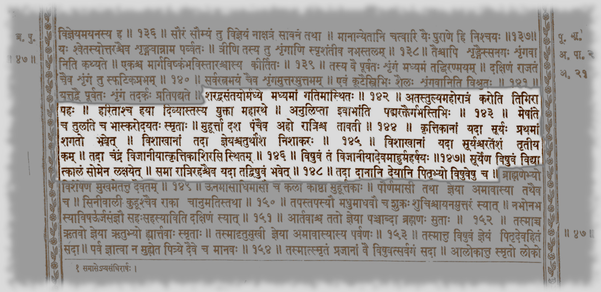
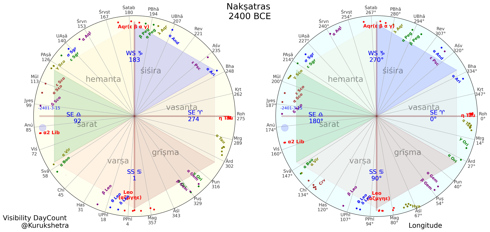
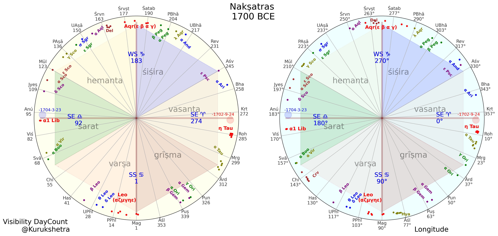
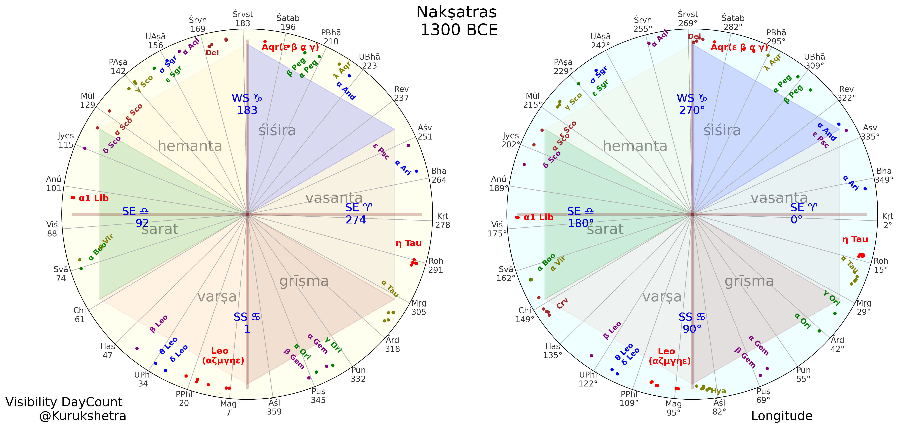

## Equinoctial Full Moon of Brahmāṇḍa Purāṇa and the solar nakṣatra zodiac starting from the summer solstice

    R. N. Iyengar & Sunder Chakravarty
    CAHC , Jain University, Bangalore

---

### Abbreviations

| | | 
|--:|:----------|
|||
| BP | Brahmāṇḍa Purāṇa | 
| LVJ | Lāgdha Vedāṅga Jyotiṣa |
| MAU | Maitrāyṇīya Āraṇyaka Upaniṣat *of yajurveda* |
| NS | Nidāna Sūtra  *an ancillary Brāhmaṇa text (anubrāhmaṇaṁ) of the Sāmaveda* |
| RV | Ṛgveda |
| TB | Taittirīya Brāhmaṇa |
||
| AE | Autumn Equinox *mid of śarat*|
| FM | Full Moon *implies Equinoctial Full Moon in this paper*|
| SE | Spring Equinox *mid of vasanta*|
| SS | Summer Solstice *MAU year start* |
| WS | Winter Solstice *LVJ year start* |

<!-- 
AB - Aitareya Brāhmaṇa
PT - Pārashara Tantra, RV - Ṛgveda
TS - Taittirīya Saṃhitā, 
VGJ - Vṛddha-Gārgīya Jyotiṣa
VP - Viṣṇu Purāṇa
ŚB - Śatapatha Brāhmaṇa
-->

---

### Gist

#### Given
|||
|:-|:--|
1| **BP** verses specifies the spring and autumnal **equinoctial full moons** using *Kṛttikā and Viśākhā nakṣatras* |
2| The **MAU** verses specifies the **Maghādi**  scheme - *the start nakṣatra Maghā heralds the summer solstice*|

#### We show
|||
|:-|:--|
A| **BP equinoctial FM** observations are **consistent** with the **solsticial Māghadi of MAU**  |
B| *MAU/BP summer solstice(SS) Māghadi* scheme is a **precusor** to *LVJ winter solstice(WS) Śraviṣṭhādi* scheme  |
C| BP **equinoctial FM** verses date to 1700-1600 BCE  |
D|  **Vedic texts** and some of the **Purāṇas**  do contain source material for mapping the **history of Indian astronomy and mathematics** before the advent of siddhānta astronomy in the early centuries of the Common Era.

---

### [Brahmāṇḍa Purāṇa *BP 21.143-149*](https://raw.githubusercontent.com/cahcblr/sanchaya/main/Puranani/brahmanda%20purana.txt)

||
|--|
| शरद्वसंतयोर्मध्ये मध्यमां गतिमास्थितः । अतस्तुल्यमहोरात्रं करोति तिमिरापहः ॥
| In *mid autumn and spring* having attained moderate pace, *the sun*, remover of darkness, therefore *makes day and night equal*. 
| हरिताश्च हया दिव्यास्तस्य युक्ता महारथे । अनुलिप्ता इवाभान्ति पद्मरक्तैर्गभस्तिभिः ॥
| The divine yellow horses, yoked to his great chariot, shine like covered with the lotus-red rays.
| मेषान्ते च तुलान्ते च भास्करोदयतः स्मृताः । मुहूर्त्ता दश पञ्चैव अहो रात्रिश्च तावती ॥
| The hours of the day and night are each reckoned as ten and five muhūrtas from the rising of the sun at the end of meshā and tulā
| कृत्तिकानां यदा सूर्यः प्रथमांशगतो भवेत् । विशाखानां तदा ज्ञेयश्चतुर्थांश निशाकरः ॥ *(more specific)*
| When the *sun is in the first part of kṛttikā*, know the *moon is in the fourth part of viśākhā*
| विशाखानां यदा सूर्यश्चरतेंशं तृतीयकम् । तदा चन्द्रं विजानीयात्कृत्तिकाशिरसि स्थितम् ॥ *(less specific)*
| When the *sun is in the third part of viśākhā*, know the *moon is in the head of kṛttikā*
| विषुवं तं विजानीयादेवमाहुर्महर्षयः । सूर्येण विषुवं विद्यात्कालं सोमेन लक्षयेत् ॥
| It is then understood to be equinox - so say the maharishis. Equinox is known through the sun and time by the moon
| समा रात्रिरहश्चैव यदा तद्विषुवं भवेत् । तदा दानानि देयानि पितृभ्यो विषुवेषु च ॥
| *When equinox occurs, night and day are equal*. Then during equinoxes offerings are made to piṭṛs 

---

### [Brahmāṇḍa Purāṇa *BP २१.१४२-१४९*](https://archive.org/details/BrahmandaMahapuranEdByDr.KVSharmaKrishnaDasAcademy/page/n158/mode/1up)

---

### Other Purāṇa verses on equinoctial full moon - similar context + some differences

**brahmānda purāṇa**
||
|--|
यत्तद्वै पूर्वतः शृङ्गं तदर्कः प्रतिपद्यते । शरद्वसंतयोर्मध्ये मध्यमां गतिमास्थितः ॥ १,२१.१४२ ॥
अतस्तुल्यमहोरात्रं करोति तिमिरा पहः । हरिताश्च हया दिव्यास्तस्य युक्ता महारथे । अनुलिप्ता इवाभान्ति पद्मरक्तैर्गभस्तिभिः ॥ १,२१.१४३ ॥
*मेषान्ते च तुलान्ते* च भास्करोदयतः स्मृताः । मुहूर्त्ता दश पञ्चैव अहो रात्रिश्च तावती ॥ १,२१.१४४ ॥
कृत्तिकानां यदा सूर्यः प्रथमां शगतो भवेत् । विशाखानां तदा ज्ञेयश्चतुर्थांश निशाकरः ॥ १,२१.१४५ ॥
विशाखानां यदा सूर्यश्चरतेंशं तृतीयकम् । तदा चन्द्रं विजानीयात्कृत्तिकाशिरसि स्थितम् ॥ १,२१.१४६ ॥
*विषुवं तं* विजानीयादेवमाहुर्महर्षयः ॥ १,२१.१४७ ॥
सूर्येण विषुवं विद्यात्कालं सोमेन लक्षयेत् । समा रात्रिरहश्चैव यदा तद्विषुवं भवेत् ॥ १,२१.१४८ ॥
तदा दानानि देयानि पितृभ्यो *विषुवेषु च* । ब्राह्मणेभ्यो विशेषेण मुखमेतत्तु दैवतम् ॥ १,२१.१४९ ॥

**vāyu purāṇa**
||
|--|
शरद्वसन्तयोर्मध्ये मध्यमां गतिमास्थितः। अहस्तुल्यामथो रात्रिं करोति तिमिरापहः ॥193॥
हरिताश्च हया दिव्यास्ते नियुक्ता महारथे। अनुलिप्ता इवाभान्ति पझरक्तैर्गभस्तिभिः ॥194॥
*मेषान्ते च तुलान्ते* च भास्करोदयतः स्मृताः । मुहूर्त्ता दश पञ्चैव अहोरात्रिश्च तावती ॥195॥
कृत्तिकानां यदा सूर्यः प्रथमांशगतो भवेत् । विशाखानां तथा ज्ञेयश्चतुर्थांशे निशाकरः॥ 50.196॥
विशाखायां यदा सूर्य श्च्रतेंऽशं तृतीयकम्। तदा चन्द्रं विजानीयात् कृत्तिकाशिरसि स्थितम् ॥197॥
*विषुवन्तं* तदा विद्यादेवमाहुर्महर्षयः। सूर्येण विषुवं विद्यात् कालं सोमेन लक्षयेत् ॥198॥
समा रात्रिरहश्चैव यदा तद्विषुवद्भवेत्। तदा दानानि देयानि पितृभ्यो *विषुवत्यपि*। ब्राह्मणेभ्यो विशेषेण मुखमेतत्तु दैवतम् ॥199॥

**viṣṇu purāṇa**
||
|--|
शरद्वसंतयोर्मध्ये तद्भानुः प्रतिपद्यते  । *मेषादौ च तुलादौ* च मैत्रेय विषुवं स्मृतम्  ॥ २,८.७४ ॥
तदा तुल्यमहोरात्रं करोति तिमिरापहः  । दशपञ्च मुहूर्तं वै तदेतदुभयं स्मृतम्  ॥ २,८.७५ ॥
प्रथमे कृत्तिकाभागे यदा भास्वांस्तदा शशी  । विशाखानां चतुर्थेऽंशे मुने तिष्ठत्यसंशयम्  ॥ २,८.७६ ॥
विशाखानां यदा सूर्यश्चरत्यंशं तृतीयकम । तदा चन्द्रं विजानीयात्कृत्तिकाशिरसि स्थितम्  ॥ २,८.७७ ॥
तदैव विषुवाख्योऽयं कालः पुण्योऽभिधीयते  । तदा दानादि देयानि *देवेभ्यः प्रयतात्मभिः*  ॥ २,८.७८ ॥

---

### Exploring the BP verses

||
|--|
Per nidāna sūtra 5.12   &nbsp; &bull; Sun spends *13 and 5/9 days equally* with each naḳsatra    &nbsp; &bull; The sun completes one trip through the 27 nakṣatras in 366 days
We model each naḳsatra sector equally to be 1/27th part of the naḳshtra circle  *366 days = 360°*
The **BP** verses specify the spring and autumnal equinoctial full moons using Kṛttikā and Viśākhā nakṣatras. This information enables us to date the verses.
We collect FM longitudes that occur near the equinoxes from 2400BCE to 0BCE.  There are about 7 such events a century for each equinox
We mark the **Kṛttikā and Viśākhā sectors** such that equinoxes are at ¼ kṛttikā and ¾ viśākhā. 
We collect the **visible Kṛttikā(η Tau) and Viśākhā(α Lib)** longitudes adjusted for precession from 2400BCE to 0BCE.
The references to Meṣa and Tulā are anachronistic, possibly a later interpolation, and are not used in the analysis.

#### The Findings
||
|--|
**&bull; 1980-1610 BCE** : The *visible Kṛttikā & Viśākhā* are *contained in their respective sectors* 
**&bull; 1700-1610 BCE** : The equinoctial *FM  at ¾ viṣākhā sector is nearest to visible viśākhā* 

---
### Dates of Equinoctial Full Moons in BP - *~1700-1610 BCE*

|||
|--:|:--|
Axes | BCE years on the x-axis and longitudes/nakṣatra sectors on the y-axis
Green Dots | **Equinoctial Full Moons**  
Red Sector | Extent of **Kṛttikā sector** containing SE *(Sun at 0°)* in its 1st amśa
Blue Sector | Extent of **Viśākhā sector** containing AE *(Sun at 180°)* in its 3rd amśa
Sloping Red/Blue| **Visible Kṛttikā/Viśākhā longitudes** adjusted for *precession*
Light Gray Band | Epoch for  **visible Kṛttikā/Viśākhā** are in **their respective sectors** ~*1980-1610 BCE*
Dark Gray Band| Epoch for **AE FM at 4th amśa of Viśākhā closest to visble Viśākhā** ~*1700-1610 BCE*

---

### [Maitrāyaṇīya Āraṇyaka Upaniṣat *MAU 6.14*](https://github.com/cahcblr/sanchaya/blob/647880cd98978d739d122a9a6b7069a4d56c6f3d/Vedic%20texts/YV/MAU-text.txt#L2)

||
|--|
|सूर्यो योनिः कालस्य तस्य एतद्रूपं ।
| Sun and Time are contemporaries
|यन्निमेषादि कालात्संभृतं द्वादशात्मकं वत्सरम् ।
| वत्सरः(year) has 12 parts and   is filled with time units starting with निमेषा(eye wink)
|एतस्याग्नेयमर्धमर्धं वारुणम् ।
| Year's first half is आग्नेयः(Āgneya) and  the second half is वारुणः(Varuṇa)
|*मघाद्यं श्रविष्ठार्धमाग्नेयं* क्रमेणोत्क्रमेण सार्पाद्यं श्रविष्ठार्धान्तं सौम्यम् ।  
| *Āgneya - from मघादि (Maghā start) to श्रविष्ठार्धः(half of Śraviṣṭhā)*   Varuṇa - from सार्पादि(Sārpā start) to श्रविष्ठार्धान्तः(end of half of Śraviṣṭhā) in counter order
|तत्र एकमात्मनो *नवांशकं* सचारकविधम् । 
| In each part, the Sun traverses 9 amṣa( portions) in order **9 amṣa(portion) for each of the 12 year parts implies each nākshatra has 4 amṣa** 

---

### [Nidānasūtra  *NS 5.12*](https://archive.org/details/in.ernet.dli.2015.408135/page/n173/mode/2up?view=theater)

||
|--|
स एष नाक्षत्रः आदित्यसंवत्सरो । *सः एषः नाक्षत्रः आदित्यसंवत्सरः ।*
This is the nakṣatra year of the sun
आदित्यः खलु शश्वदेतावद्भिरहोभिर्नक्षत्राणि समवैति । *आदित्यः खलु शश्वत्  एतावत्भिः अहोर्भिः नक्षात्राणि समवैति ।*
The sun, indeed, with these many days, stays with each nakṣatras
त्रयोदशाहं त्रयोदशाहमेकैकं नक्षत्रमुपतिष्ठति। *त्रयोदशाहं त्रयोदशाहम  एकैकं नक्षत्रम् उपतिष्ठति ।*
The sun spends **13 days** with each nakṣatra  
अहस्तृतीयं च नवधा कृतयोरहोरात्रयोर्द्वे द्वे कले चेति संवत्सराः। *अहः तृतीयं च नवधा कृतयोः अहोरात्रयोः  द्वे द्वे कले चेति संवत्सराः ।*
अहोरात्रि/3 + (2* अहः +  2* रात्रि)/9 =  **5 अहोरात्रि/9**  *13 and 5/9 days with each nakṣatra*
ताश्चत्वारिंशच्चतुःपञ्चाशतं कलाः। *ताः चत्वारिंशत् चतुःपञ्चाशतं कलाः ।*
???? Those are 40 and/times 54 kalās
ते षण्णववर्गाःसषट्षष्टित्रिशतः ॥ *ते षट् नव वर्गाः सः षट्षष्टिः त्रिशतः ॥*
???? These are 6*9 vargās and 366

---

 ### Maghā - Summer Solstice Nakṣatra with 6 stars 
|||
|--:|--|
|MAU| First nakṣatra of the Āgneya half of the year
|TB 3.1.4 | मघाभ्यः पुरोडाशं षट्कपालम्  *6 bowls indicating the 6 stars of the asterism* 
|RV 1.7.3 | इन्द्रो  दीर्घाय चक्षस आ  सूर्यं  रोहयद्दिवि ।  वि गोभिः अद्रिमैरयत्  *Indra raised the sun for a long time.  Heralding summer solstice*|
|RV 10.23.2 |  इन्द्रो  मघैः मघवान् वृत्रहा  अभुवत्  *Lord of dark clouds Indra killed Vṛtta.* *Indra released water from the dark clouds hailing varśa ṛtu* |
|Sūrya candra prajñapti|Visible nakṣatra maghā made up of six stars  identified as the group Leo(α,ζ,μ,γ,η,ε). 
|Summer Solstice visibility|α Leo (maghānta) at 2350BCE &plusmn;100  ε Leo (maghādi) at 1800BCE  &plusmn;100 *If a star has +5° alt  when Sun is at -8° alt  it is taken as visible* |

---

### BP inherits the Maghādi scheme of MAU

|||
|-:|:--|
Chart | Nakṣatra sectors, Visible nakṣatras, Seasons, Equioctial FM vs day(sunrise) count for *1700BCE*
Dial | Represents one journey of sun through the 27 nakṣatras - *366 days*
Seasons | 6 seasons each of *61 days*
Nakṣatra Sectors| The dial has 27 nakṣatra sectors, each of *13 and 5/9 days*
Visible Nakṣatras| Cardinal (magha, viśākhā, śraviṣṭa and kṛittikā)  highlighted red inside the dial
Maghā | **Summer solstice** nakṣatra spans day 1 to 14 starting with **ε Leo** being **SS point on day 1** - good candidate for *maghādi*
Śraviṣṭā | **Winter solstice** nakṣatra spans day 176 to 189 starting with **β Aqr** begin the **WS point on day 183** - good candidate for *śraviṣṭhārdha*
BP MAU Agreement | **BP equinoctial FM** at ¼ kṛittikā and ¾ viṣakhā  are **consistent** with the **solsticial Māghadi of MAU**  |

---

### Evolution of The Seasonal Nakṣatra Cycle evolution from the *maghādi* scheme of MAU to the *śraviṣṭhārdha* scheme of LVJ
||||||
|-:|:-|:-|:-|:-|
|bce|दक्षिणायन/SS|शरत्/AE|उत्तरायण/WS|वसन्त/SE|
2400 | Sun @ maghānta (α Leo) **MAU early** | -  | - | Sun@visibleKṛittikā |
1700 | Sun @ maghādi (ε Leo) **MAU** | FullMoon@ ¾viṣakhā Sun@ ¼ kṛittikā *BP* | Sun @ śraviṣṭhārdha (β Sgr)  | FullMoon@ headKṛittikā Sun@ ¾ viṣakhā *BP* |
1300 | - | - | Sun @ śraviṣṭhādi (β Del) **LVJ**  | |

---

### [Seasonal Nakṣatra Cycle Animation from 2400 BCE to 1000 BCE](https://raw.githubusercontent.com/suchakr/cahc-utils/sunder_experiments/presentations/equinoctial-full-moon/ndial_1.gif)

---

### References

| # | |
|---:|---|
1|**Abhyankar, K. D. (1991)**[Misidentification of some Indian nakṣatras. Indian Journal of History of Science, 26(1), 1–10.](https://github.com/suchakr/cahc-utils/blob/main/papers/naks/naks-1991-abyn-misidentified-naks.pdf)
2|**Das P. (2018)** [Bhāgavata Cosmology; Vedic Alternative to Modern Cosmology, Tulsi Books, Mumbai.](https://tulsibooks.com/product/bhagavata-cosmology-vedic-alternative-to-modern-cosmology/)
3|**Gondalekhar, P. (2013)** [The time keepers of the Vedas. Manohar. [ISBN 978-81-7304-969- 9].](https://www.amazon.in/Time-Keepers-Vedas-History-Calendar/dp/8173049696)
4|**Iyengar, R. N. (2013)** [Parāśara Tantra (Ed. Trans & Notes). Jain University Press. [ISBN 978-81-9209-924-8].](https://www.amazon.in/Time-Keepers-Vedas-History-Calendar/dp/8173049696)
5|**Iyengar R.N. (2016)** Astronomy in Vedic texts,(Book Chapter pp.107-169). History of Indian Astronomy A Handbook, (Ed. K.Ramsubramanian, A.Sule &M. Vahia)  Publn. by IITB and TIFR, Mumbai.
6|**Iyengar R.N. and  Chakravarty, S (2021)** [Transit of sun through the seasonal nakṣatra cycle in the Vṛddha‐Gārgīya Jyotiṣa, Indian Journal of History of Science 56:159–170.](https://github.com/suchakr/cahc-utils/blob/main/papers/vgj/vgj-2022-01-rni-sc-sun-transit.pdf)
7|**Koch D. (2014)** [Astronomical dating of the Mahābhārata war. Erlenbach, Switzerland](https://www.gilgamesh.ch/KochMahabharata6x9_V1.00.pdf)
8|**Sastry T. S. K. (1984)** [Vedāṅga Jyotiṣa of Lagadha. Indian Journal of History of Science, 19 (4), l–74.](https://github.com/suchakr/cahc-utils/blob/main/papers/lvj/lvj-1984-kuppanna.pdf)
9|**Sengupta, P. C. (1947)** [Ancient Indian Chronology. Univ. of Calcutta.](https://indianculture.gov.in/ebooks/ancient-indian-chronology-illustrating-some-most-important-astronomical-methods)
10|**Srinivas M.D. (2019)** [The Untapped Wealth of Manuscripts on Indian Astronomy and Mathematics Indian Journal of History of Science, 54.3, 243-268.](https://www.researchgate.net/profile/M-Srinivas/publication/336438227_The_Untapped_Wealth_of_Manuscripts_on_Indian_Astronomy_and_Mathematics/links/602b2bd94585158939a94482/)
11|**Thompson R. L. (2007)** [The Cosmology of the Bhāgavata Purāṇa (Indian Edn.) Motilal Banarsidass, Delhi.](https://www.motilalbanarsidass.com/products/the-cosmology-of-the-bhagavata-purana-mysteries-of-the-sacred-universe)
